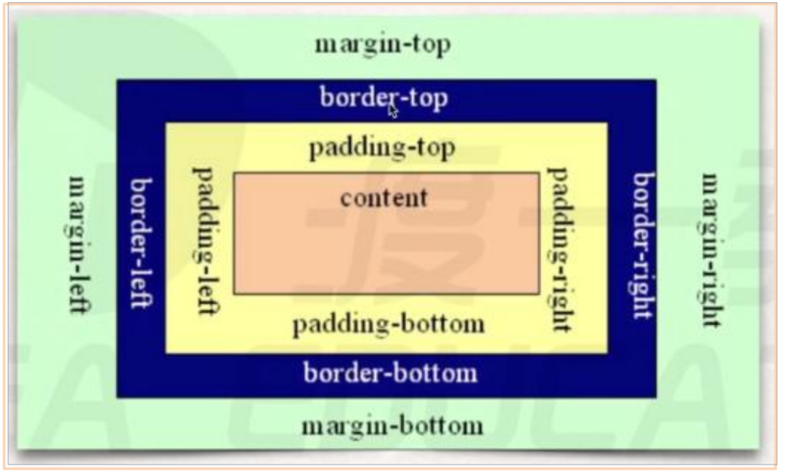

# CSS

cascading style sheet 层叠样式表


## 引入

1. 行内样式表(行内式) 

   ```html
   <div style=" width: 100px; height: 100px; "></div>
   ```

   

2. 内部样式表(嵌入式) 

   type = “text/css”的意思是告诉浏览器，我这里面是css，可写可不写

   ```html
   <head>
     ...
     
     <style type = “text/css”>
       div{
         width: 100px;
         height: 100px;
         background-color: red;
       }
     </style>
   </head>
   <body>
     <div> </div>
   </body>
   ```

   

3. 外部样式表(链接式)

   ```html
   <head>
   	...
     <link rel="stylesheet" type = “text/css” href="./style.css">
   </head>
   <body>
     <div> </div>
   </body>
   ```

   ```css
   /** style.css **/
   div{
     width: 100px;
     height: 100px;
     background-color: red;
   }
   ```


## 选择器


### 标签选择器

如果想选择就写div{}，如果想选择就写span{}，不管被套多少层，都会被选择出来，而且是选择全部

```html
<div> </div>
```

```html
<style>
  div {
  	background-color: red;
  }
</style>
```


### id 选择器

特点：一个元素只能有一个id值，一个id只对应一个元素，一一对应的

```html
<div id='idname'> </div>
```

```html
<style>
  #idname {
  	background-color: red;
  }
</style>
```


### class选择器

特点：一个class可以对应多个元素

```html
<div class='classname'> </div>
<div class='classname classname1'> </div>
```

```html
<style>
  .classname {
  	background-color: red;
  }
  .classname1 {
    color:'#fff'
  }
</style>
```

### 通配符 * 选择器

*是任意的意思，此处是all，所有的标签（包括和）

```css
* {
  margin:0;
  padding:0;
}
```


### 父子选择器 / 派生选择器

最外面的结构 外面的结构 里面的结构{}

```css
<style>
div p span {
  color: red;
}
div .p-sty span {
  color: red;
}
</style>

<div>
  <p class="p-sty">
    <span></span>
  </p>
</div>

```


> **注意**：
>
> 父子选择器中，每一个层级，都不一样要是标签选择器，写class选择器也行，
>
> 重要的是表达出来父子关系。而且这种父子关系有可能是间接地，也有可能是直接
>
> 的


### 直接子元素选择器

```css
<style>
div > span {
  color: red;
}
</style>

<div>
	<span>1</span>  变成红色
  <p class="p-sty">
    <span>2</span> 不变
  </p>
</div>
```

**思考**：浏览器是从右向左，还是从左向右找？


```css
section div ul li a em {
	 color: red;
}
```

**答案**：浏览器遍历的时候是从右向左找的(先看em,再看a,再看li,再看ul,再看div)，更快更有效率


### 并列选择器

格式p.p-sty在 **.** 之前不用写空格，这就是并列选择器

```html
<style>
  p.p-sty{
    color: red;
	}
</style>

<div>
	<span>1</span>  变成红色
  <p class="p-sty">
    <span>2</span> 不变
  </p>
</div>
---------------------------------------------
em#id   /  div[class='divclass'] / div.divclass / div.divclass > div[class='divclass']
```


### 分组选择器

组之间用 **，**分割

```css
<strong> strong </strong>
<em> em </em>
<span> span </span>

/** css  **/
strong,
em,
span {
	color:red
}

```


### 伪类选择器

格式任意选择器:怎么动

- **a:link** 未访问的链接显示`orange`的颜色；
- **a:visited** 已访问的链接显示`red`的颜色；
- **a:hover** 鼠标挪动到链接上(重要)显示`green`的颜色；
- **a:active** 激活的链接（鼠标在链接上长按住未松开）显示`blue`的颜色；

```CSS
任意选择器:hover是一种比较常见的写法
<a href="www.baidu.com"></a>

a:hover {}
[href]:hover {}
```

- **使用注意**
- **:hover** 必须放在 **:link** 和 **:visited**后面才能完全生效；
- **:active** 必须放在 **:hover** 后面才能完全生效；
- 所以建议的编写顺序是 **:link、:visited、:hover、:active**；

其他伪类选择器

> :nth-child( )
>
> :first-child：等同于:nth-child(1)
>
> :last-child：等同于:nth-last-child(1)
>
> :first-of-type：等同于:nth-of-type(1)
>
> :last-of-type：等同于:nth-last-of-type(1)
>
> :only-child：是父元素中唯一的子元素
>
> :only-of-type：是父元素中唯一的这种类型的子元素
>
> :root：根元素，就是HTML元素
>
> :empty：代表里面完全空白的元素


### 伪元素选择器

::before -- 在元素内部的前面插入内容

::after -- 在元素内部的后面插入内容

- before和after创建一个元素，但是属于行内元素
- 新创建的这个元素在文档树中是找不到的，所以我们称为伪元素
- 语法：div::before{}
- before和after必有content属性
- before在父元素内容的前面创建元素，after在父元素内容的后面插入元素

```css
<style>
	div::before{
    content: '--';
  }
  div::after{
    content: '---';
  }
</style>

<div>

</div>
```


### CSS选择器权重

| 选择器                                          | 权重           |
| ----------------------------------------------- | -------------- |
| ! important                                     | infinity正无穷 |
| 行间样式                                        | 1000           |
| id选择器                                        | 100            |
| class选择器、属性选择器 [id='only']、伪类选择器 | 10             |
| 标签选择器、伪元素选择器                        | 1              |
| 通配符选择器                                    | 0              |

> 在计算机中，正无穷+1 > 正无穷
>
> 如果权重值一样（优先级一样），会显示后面的
>
> 就是先来后到，谁在后面，谁（后面的）覆盖前面的——后面的会覆盖前面的

> 在权重中，是256进制，是从0到255后变成1 
>
> 所以这里的1000不是一千，100不是一百


## 样式

属性名：属性值；每一个属性与属性之间用分号;隔开

### 文字

##### font-size

- 设置字体大小，默认是16px，但是互联网字体一般用12px或14px。

- 这个设置的是字体的**高度**

- ```css
  font-size: 12px;
  ```


##### font-weight

- 字体的粗细是跟字体包有关

- 值：

  1. lighter -- 细体
  2. normal -- 正常（默认值）
  3. bold -- 加粗，跟strong效果是一样的
  4. bolder -- 加更粗
  5. 100,200到900  -- 从细到粗，都是整百来表达

- ```css
  font-weight: 500;
  ```

  

​    

##### font-style

- italic 斜体，em这个标签本身就带有italic的样式

- ```css
  font-style: italic;
  ```

  

​    

##### font-family

- 设置字体包的样式

- arial; 这个是乔布斯发明的字体

- ```css
  font-family: arial ... ...;
  ```


##### color

- 字体颜色

- 字体颜色的color三种写法

  1. 纯英文单词：red，green等（一般不用）
  2. 颜色代码，如#ff4400; 其中每两位都是从00到ff，分别对应红r（从00到ff），绿g（从00到ff），蓝b（从00到ff），这是一个十六进制的数，代表的是饱和度，如果没两位都可以重复，那么简写成#f40淘宝红，#ffffff白色，#000000黑色。
  3. 颜色函数，如color:rgb(255,255,255); 这是白色， rgb（0-255，0-255，0-255）里面的0-255是十进制数 **transparent** 是透明色

  

##### text-align

- 文字对齐方式

- 值：  

  1. left  --  左对齐
  2. conter -- 一行居中
  3. right -- 右对齐

- ```css
  text-align: center;
  ```


##### line-height

- 单行文本所在的高度

- 当 line-height=height （文本所占高度=容器高度）时，单行文本水平垂直居中

- 1.2em 单行文本所在的高度。意思是文字的行高是1.2 倍行高

- ```css
  line-height:16px;
  ```

  

##### text-indent

- 首行缩进

- 2em 意思是首行缩进2em（2个文本单位）

- 单位的衡量标准

  1. 绝对单位（m，cm等），相对单位（px，em等）
  2. px是像素的意思，一个像素只能显示一个颜色；
  3. 屏幕的分辨率，就是说的像素，国际标准是每英寸所能容纳的垂直像素点数。
  4. em是文本单位，1em = 1* font-size    该文本的字体大小

- ```css
  text-indent: 2em;
  ```
  
  

  

##### text-decoration

- 设置文字 是否 有线

- 值：

  1. line-through  -- 中划线
  2. none -- 没有线
  3. underline -- 下划线
  4. overline -- 上划线（基本没用）

  

- ```css
  text-decoration: none;
  ```
  
  

##### cursor    

1. 光标定位值（cursor: pointer;鼠标变成一个小手）

2. ```css
   cursor: pointer;
   ```

   ​                                                                                                                                                                                                                                                                                                                                                                                                                                                                        

### 分类

1. 行级元素

   featrue(特色)：内容决定元素所占位置，不可以通过css改变宽高

   元素：span、a、strong、em

   行级元素中有 `dispaly: inline;`

   行级元素 只能 嵌套 行级元素

2. 块级元素

   featrue(特色)：独占一行，可以通过css改变宽高

   元素：div 、p、h1-h6、ul、ol、li、form

   块级元素中有 `dispaly: block;`

   块级元素 可以嵌套 块级元素 和 行级元素 和 行级块元素

3. 行级块元素

   featrue(特色)：不独占一行，可以通过css改变宽高

   元素：img

   行级块元素中有 `dispaly: inline-block;`

   

> 写成 display:none; 元素就没有了

> 凡是自带 **inline** 特效的元素，都有文字特性，有文字特性就会**被分割**

> 最好的编程思想：先写css定义颜色尺寸等，再写html
>
> 也就是先定义功能，后选配功能（方便团队合作）

注意：

> p标签 不能套 div标签  div 会将 p分成两个
>
> a标签 不能套 a标签

### 初始化元素

> 改变html自带的系统属性，变成自定义标签

```css
<em>本身自定义是斜体</em>
em{
	font-style:normal;
	color:#c00;
}
```

```css
<ul>
  <li>1</li>
  <li>2</li>
  <li>3</li>
</ul>

ul{
  list-style:none;     /*去掉圆点*/
}
```

```css
<a href = “#”>123</a>

a{
  text-decoration:none; /*  去掉下划线  */
  color:#424242;	/*  修改颜色  */
}
```

```css
*通配符选择器能初始化所有的标签
*{
  padding:0;
	margin:0;
	text-decoration:none;list-style:none;
}
```


### 盒模型


#### 组成

盒子组成：3部分组成

1. 盒子壁 border
2. 盒子内边距 padding
3. 盒子内容 content = width + height


盒子模型组成：4部分组成

1. 盒子壁 border
2. 盒子内边距 padding
3. 盒子内容 content = width + height
4. 盒子外边距 margin





#### padding 和 margin

二者是复合值

1. 一个值：表示 四边

   ```css
   padding: 10px;
   margin: 10px;
   ```

2. 两个值：表示 上下 左右

   ```css
   padding: 10px 20px;
   margin: 10px 20px;
   ```

3. 三个值：表示 上  左右  下

   ```css
   padding: 10px 20px 5px;
   margin: 10px 20px 5px;
   ```

4. 四个值：表示 上  右  下  左

   ```css
   padding: 10px 20px 30px 40px;
   margin: 10px 20px 30px 40px;
   ```

> 可单独设置
>
> margin-top / margin-left / margin-bottom / margin-right
>
> padding-top / padding-left / padding-bottom / padding-right


#### 盒模型的计算

> margin 不算盒子，所以计算的时候不能算上 margin

可视区域的宽高

- 宽 - realWidth = `width` + 左右的 `border` + 左右的 `padding`
- 高 - realHeight = `height` + 上下的 `border` + 上下的 `padding`


### margin BUG

1. margin 塌陷

   父子嵌套元素垂直方向的margin，父子元素是结合在一起的，他们两个会取其中最大的值

   使用BFC解决

2. margin 合并

   两个兄弟结构的元素，他俩垂直方向的margin是合并的

   不解决


### BFC

如何触发一个盒子的 BFC 

- position：absolute； 绝对定位
- display：inline-block；设置成行内块
- float：left / right；浮动
- overflow：hidden；溢出隐藏

> 这四种方法都能触发bfc，但是使用的时候都带来了新的麻烦
>
> 在具体情况中，针对需求，哪个触发方式没有影响，就用哪个解决塌陷问题


### 定位 position

position 值：

- **absolute**  -- 绝对定位 

  1. 脱离原来位置定位
  2. 相对于**最近的** *有定位* 的父级进行定位；如果没有有定位的父级元素，就相对于文档进行定位
  3. 定位元素需要配合right，left，top，bottom使用（浏览器y轴是向下的），但是一般是不设置bottom的，因为浏览器一般没有底部

  

- **relative**  -- 相对定位

  1. 保留原来位置进行定位
  2. 相对于自己原来（出生的）的位置进行定位

  

- **fixed** -- 固定定位

  1. 脱离原来位置定位

  2. 相对屏幕定位

     

- **sticky** -- 粘性定位

  1. sticky 不会触发 BFC

  2. 样式表 z－index 无效。行内 style 写有效。

  3. sticky 是容器相关的，也就说 sticky 的特性只会在他所处的容器里生效。

     注意：

     > 1. 父级元素不能有任何overflow:visible以外的overflow设置。即使是scroll或者auto也不行。
     > 2. 父元素的高度不能低于sticky元素的高度
     > 3. 同一父容器中的sticky元素，如果定位置相等，则会发生重叠，
     > 4. 必须制定top,left,bottom,right四个中的至少一个，否则其行为与相对定位相同，并且top和bottom同时设置时，top的优先级高；left和right同时设置时，left的优先级高

     

     

- **static** -- 静态定位/常规定位/自然定位

  1. 忽视top、bottom、left、right、z-index，是这些关键字作用失效
  2. 如果两个元素都设置了外边距，最终的外边距取决于外边距大的
  3. 在具有固定width和height值时的元素，如果把左右边距设置成auto，则左右边距会自动扩大占满剩余宽度，实现这个块水平居中的效果


> 我们一般用relative作为参照物（不用relative进行定位），用absolute进行定位
>
> ​		给一个元素只设置一个relative，不设置left，right，top，bottom，看起来是对这个元素没什么影响的，但是它保留了原来的位置，就对后续元素没有什么影响absolute可以任意的调整自己的参照物，更加灵活，所以用于定位想让谁成为基地，就给谁relative定位，并且不设置方向


### 浮动 float

作用： 让元素排队

> float站队时，够站一个就站一个，不够站一个就换行
>
> float站队的边界就是父级元素的边界

值：left / right

```css
float: left;
```


```css
<div class="wrapper">
  <div class="content">1</div>
  <div class="content">2</div>
  <div class="content">3</div>
</div>

.wrapper {
  width:300px;
  height: 300px;
  border: 1px solid #333;
}
.content {
  float: left;
  width: 100px;
  height: 100px;
  background-color: black;
  color: #fff;
}
```

##### float：left

float：left 使方块按 123 排序


##### float：right

float：right 使方块按 321 排序


> float:left是让元素自左向右排序，float:right是让元素自右向左排序


##### 浮动元素产生浮动流

效果：

1. 所有产生了浮动流的元素，块级元素看不到他们。（覆蓋其它块元素）

   ```css
   .demo{
     float:left;
     width: 100px;
     height: 100px;
     background-color: red;
   }
   .demo1{
     width: 200px;
     height: 200px;
     background-color: green;
   
   }
   <div class="demo"></div>
   <div class="demo1"></div>
   ```

   

   

   

2. 产生了bfc的元素和文本类属性（带有inline属性就是文本类属性）的元素以及文本都能看到浮动元素。（不会被浮动元素覆盖）

   ```css
   .demo{
     float:left;
     width: 100px;
     height: 100px;
     background-color: red;
   }
   <div class="demo"></div>123
   ```

   


##### 父级塌陷

> 当 父级没有设置宽高时，浮动的子元素不会撑起父级

```css
<div class="wrapper">
  <div class="content">1</div>
  <div class="content">2</div>
  <div class="content">3</div>
</div>

.wrapper {
  border: 1px solid #333;
}
.content {
  float: left;
  width: 100px;
  height: 100px;
  background-color: black;
  color: #fff;
}
```


> 父级包不住了，因为父级是块级元素，看不到浮动元素


**想父级包住子级**

1. 方法一是加height（只能解决一小部分）
2. 方法二是清除浮动流用clear清除周边的浮动流


##### 清除浮动

**伪元素选择器**

- 伪元素天生就存在于`任意一个元素`（标签tag element）里面。

- 天生是`行级元素`。

- 为什么叫伪元素？

  因为他的元素结构是存在的，但是他没写到HTML里面，他可以被css选中，并正常操作，但是他没有html结构，所以叫伪元素。

- 他有两个特殊的伪元素 `before` 和 `after`


> 为了清除 float 的浮动流，就可以用到伪元素，也是最好的选择
>
> clear 很特殊，想让他生效，必须是块级元素才可以，而::after是行级元素


```css
.wrapper::after{
  content: ' ';
  clear: both;
  display: block;
}
```


浮动元素用完，尽量都清除浮动流


**触发BFC**

```css
.wrapper {
  display: inline-block;
  border: 3px solid red;
}
.content {
  float: left;
  width: 100px;
  height: 100px;
  background-color: black;
  color: #fff;
}

<div class="wrapper">
  <div class="content">1</div>
  <div class="content">2</div>
  <div class="content">3</div>
</div>
```


上面都是紧紧的包住，而不是把他撑开了


> 凡是设置了position:absolute；或float：left/right；他会打系统内部，把元素转换成inline-block，所以由内容来决定宽高，改成block才能独占一行

```css
span{
  position:absolute;
  width:100px;
  height:100px;
  background:red;
}
```

上述给 span 设置了 `position: absolute;` 后系统会将 span 设置成 `display: inline-block`


##### 文字环绕功能

```css
img{
  width: 100px;
  float: left;
}
文字......................................

..................
```


### 文字溢出

##### 单行文本

> 容器必须 `设置宽度`

```css
white-space: nowrap;
overflow: hidden;
text-overflow: ellipsis;
```

```css
<p>杀得快放假哈斯东方丽景卡还是大富科技哈斯劳动法花生豆as抠脚大汉疯狂拉时间和地方</p>

p{
  width: 300px;

  white-space: nowrap;
  overflow: hidden;
  text-overflow: ellipsis;

}
```


##### 多行文本 ( 做截断 )

用手写上去的，估算出来的，老版本的浏览器支持不太好，所以不用这种方法

移动端上可以实现

height是line-height的两倍，就展示两行，内容区域高是单行文本的高度整数倍。算好了高度就可以做截断了

```css
p{
  width: 300px;
  height: 60px;
  line-height: 20px;
  overflow: hidden;
}
<p>
  杀得快放假哈斯东方丽景卡还是大富科技哈斯劳动法花生豆抠脚大汉疯狂拉时间和地方
  杀得快放假哈斯东方丽景卡还是大富科技哈斯劳动法花生豆抠脚大汉疯狂拉时间和地方
  杀得快放假哈斯东方丽景卡还是大富科技哈斯劳动法花生豆抠脚大汉疯狂拉时间和地方
</p>
```

```css
//超出两行省略号
display: -webkit-box;
overflow: hidden;
-webkit-box-orient: vertical;
line-clamp: 2;
-webkit-line-clamp: 2; //显示几行
```


### 背景图片


```css
div{
  width:100px;
  height:100px;
  background-image: url(./img/image-20230109175206274.png);
  background-size: 100px 100px;
  background-repeat: no-repeat;
  background-position: left bottom;
  background-position: 20px 50px;
  background-position:50% 50%;
}
```


| 样式                               | 描述                                                         |
| ---------------------------------- | ------------------------------------------------------------ |
| background-image: url(这里放地址); | 图片当做背景图片来展示                                       |
| background-size: 100px  50px;      | 设置背景图片的大小，第一个是宽，第二个是高                   |
| background-repeat: repeat;         | 默认值是repeat，重复出现。<br />设置成no-repeat就不重复出现，就只出现一张；（一般都用no-repeat）<br />设置成repeat-x就是x轴重复；<br />设置成repeat-y就是y轴重复。 |
| background-position:100px 100px;   | 设置图片在容器中的位置，图片的左上定点离容器的左上定点的距离<br /> |
| background-position:left bottom;   | 左下。填center center就居正中了                              |
| background-position:50% 50%;       | 就是居正中，和center center一样，不是按照左上定点来居中的    |


### 加载策略

一旦浏览器采取了默认的加载策略（只加载html，不加载css和js），网页也要好用想让css不能使用时，文字出来；css能用的时候，文字隐藏。有两种方法。

**方法一：**

1. 用text-indent:190px;首行缩进，

2. 缩进距离大于内容区的宽度

3. 用white-space:nowrap;强制文本不换行

4. 用overflow:hidden;溢出部分隐藏

   

```css
<a href='www.taobao.com' target='_blank' > 淘宝网 </a>
a{
  display:inline-block;
  text-decoration:none;
  color:#f40;
  width:190px;
  height:90px;
  background-image:url(./taobao/jpg);
  background-size:190px 90px;
  /* 重点  */
  text-indent:190px;
  white-space:nowrap;
  overflow:hidden;
}
```


**方法二：**

1. 背景颜色，图片会作用在padding上，但是内容（文字）不能作用在padding上
2. 让 height=0 容器就会变成一条线，并且文字在图片外面 
3. 然后再加padding-top:90px；那么padding里面就会显示图片
4. 最后用overflow:hidden;溢出部分隐藏


```css
<a href='www.taobao.com' target='_blank' > 淘宝网 </a>
a{
  display:inline-block;
  text-decoration:none;
  color:#f40;
  width:190px;
  height:0;
  background-image:url(./taobao/jpg);
  background-size:190px 90px;
  /* 重点  */
  padding-top:90px;
  overflow:hidden;
}
```


